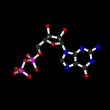

MolScript v2.1.2
================

    Copyright (C) 1997-1998 Per J. Kraulis

<table>
  <tr>
    <td>
      
    </td>
    <td>
      
    </td>
    <td>
      
    </td>
  </tr>
</table>

MolScript is a program for displaying molecular 3D structures, such as
proteins, in both schematic and detailed representations.

The documentation is at [http://pekrau.github.io/MolScript/](http://pekrau.github.io/MolScript/).

Background
----------

MolScript has for a long time been a standard tool in the science of
macromolecular structures. [The paper describing
it](http://dx.doi.org/10.1107/S0021889891004399 "MOLSCRIPT: a program
to produce both detailed and schematic plots of protein structures.")
appears as number 82 in the list of the Nature feature article ["The
Top 100 Papers. Nature explores the most-cited research of all
time"](http://www.nature.com/news/the-top-100-papers-1.16224) by
Richard Van Noorden, Brendan Maher & Regina Nuzzo published [30 Oct
2014](http://www.nature.com/nature/journal/v514/n7524/index.html).

I have written a blog post [MolScript: A story of success and
failure](http://kraulis.wordpress.com/2014/11/03/molscript-a-story-of-success-and-failure/),
describing the history behind its rise and fall.

Open Source
-----------

MolScript is now available under the MIT license from this GitHub
repository. I have for a long time intended to make MolScript Open
Source, but never got around to it. The Nature Top-100-list did the
trick of pushing me into action.

Version 2.1.2
-------------

The first version of MolScript (written in Fortran 77) was released in
1991, and its current version (2.1.2, written in C) in 1998.

Please be aware that no changes have been made to the code since
1998. In particular, the Makefile for the executable including OpenGL
support is not up to scratch. It needs updating. If anyone is willing to
help, I would much appreciate it.

I have tested the `Makefile.basic` file, which builds an executable
with support for PostScript, Raster3D and VRML. It works, at least on
Ubuntu 12.04. I have also verified that the [Raster3D software
(v3.0)](http://skuld.bmsc.washington.edu/raster3d/html/raster3d.html)
still works with MolScript.

Future plans
------------

I have very little time to work on MolScript currently. Other projects
are more pressing. If anyone is willing to "take over" (i.e. fork) and
continue developing MolScript, I would be very pleased.

Here are some possible items for a roadmap for future development of MolScript:

* Fix the OpenGL implementation, with a working Makefile.

* Prepare a proper Debian package for easier installation.

* Add a proper interactive interface to the OpenGL implementation. The
  script language was nice once upon a time, but today it must be
  considered as user-hostile and cumbersome.

* Write an implementation to produce
  [X3D](http://www.web3d.org/x3d/what-x3d), the successor to the VRML
  format for 3D objects on the web.

* Write a [WebGL](http://en.wikipedia.org/wiki/WebGL) implementation.

* Set up a web service producing images from input scripts using MolScript.

Reference
---------

    Per J. Kraulis
    MOLSCRIPT: a program to produce both detailed and schematic plots of
    protein structures.
    J. Appl. Cryst. (1991) 24, 946-950

This paper is now available under Open Access: [PDF](docs/kraulis_1991_molscript_j_appl_cryst.pdf)

[DOI:10.1107/S0021889891004399](http://dx.doi.org/10.1107/S0021889891004399)

[Entry at J. Appl. Cryst. web site](http://scripts.iucr.org/cgi-bin/paper?S0021889891004399)

